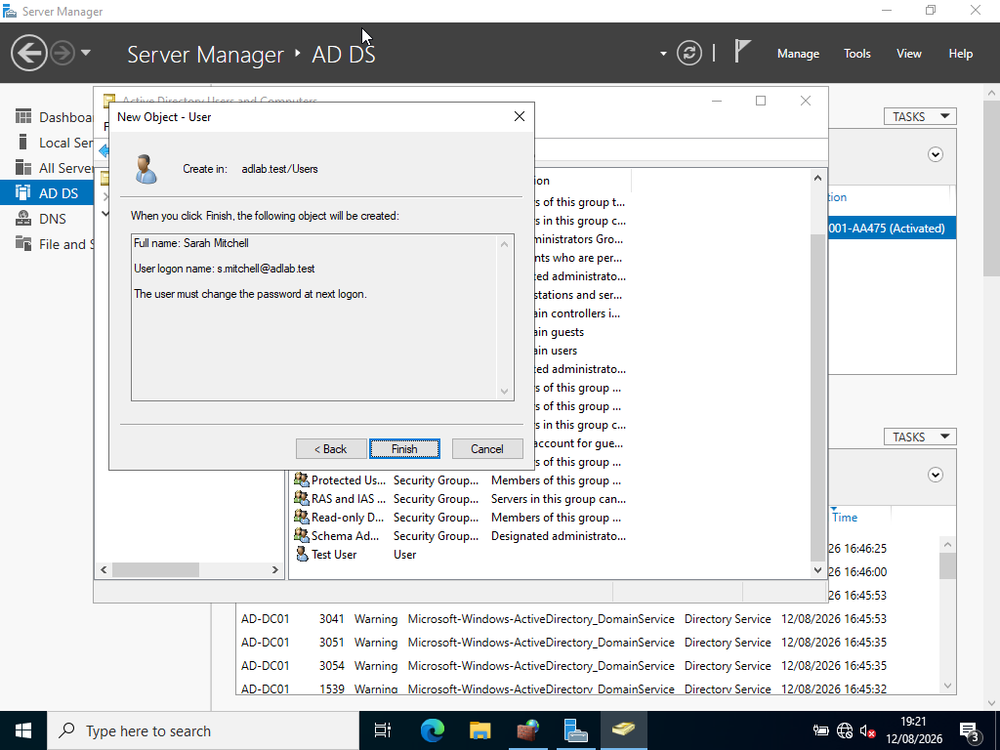
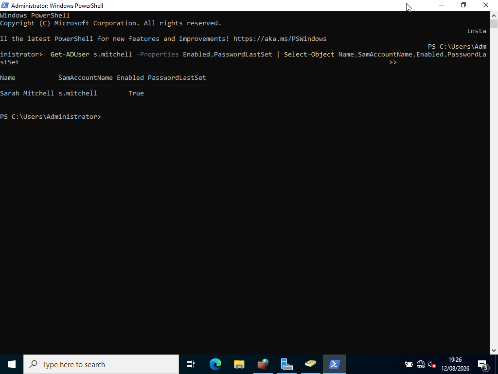
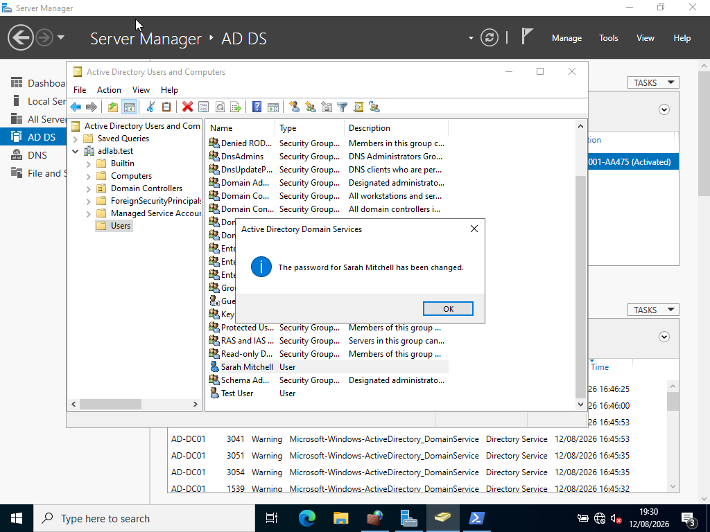
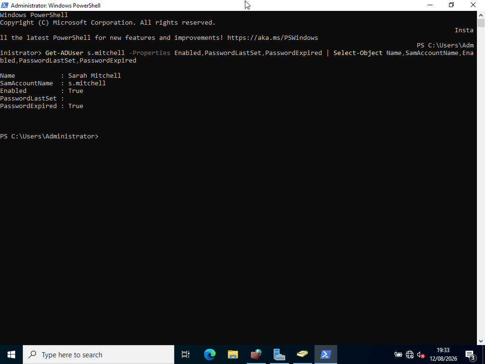
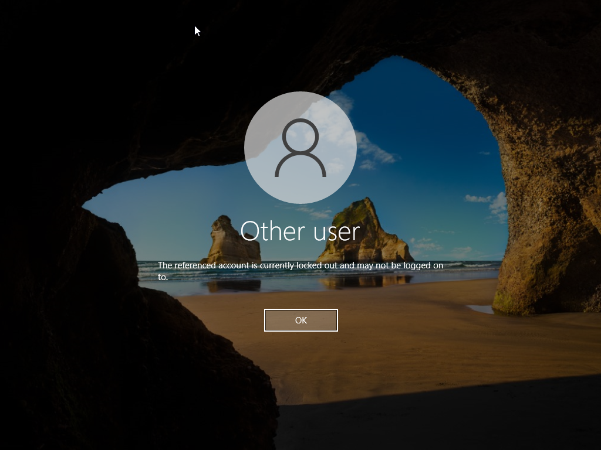
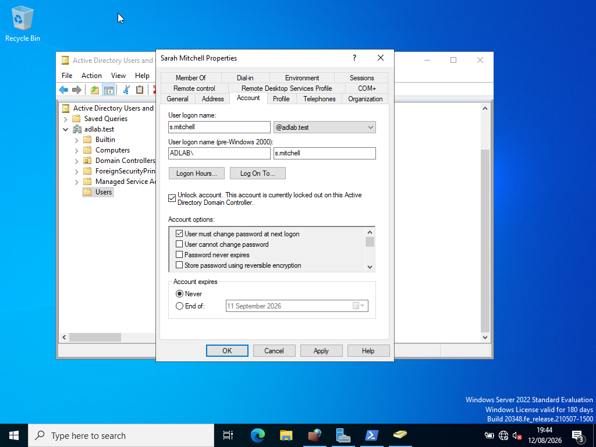
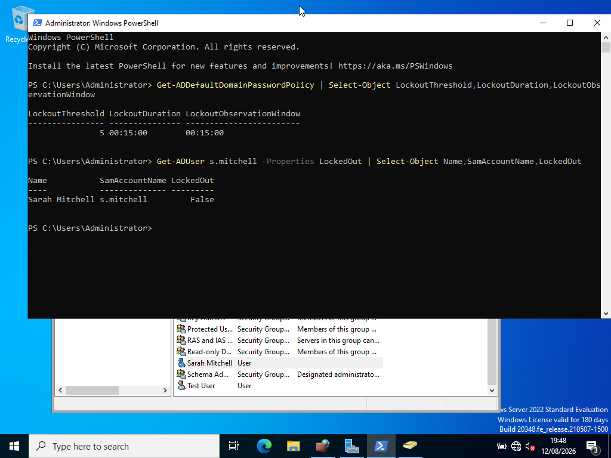
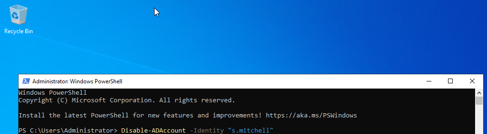
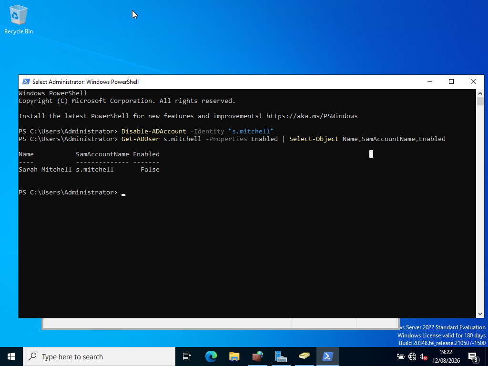
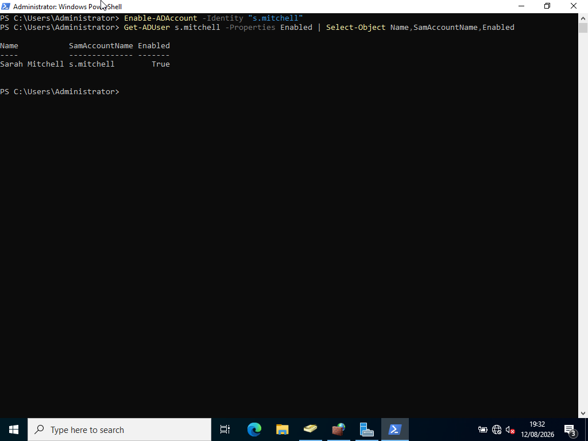

# Lab 01 — User Account Management

**Status:** Completed  
**Project:** Active Directory Helpdesk Lab  
**Focus:** Active Directory User Administration

---

## Overview

This lab demonstrates common Active Directory user account management tasks that an IT Support, Service Desk, or 1st Line Support technician may perform.

The lab was completed in a controlled virtual environment using Windows Server, Active Directory Domain Services (AD DS), Active Directory Users and Computers (ADUC), PowerShell, and a Windows 11 Pro support workstation.

The exercises were designed around realistic Service Desk scenarios involving user account creation, password management, account lockouts, account disabling, and account re-enabling.

The lab follows a structured support methodology:

> **Task / Problem → Investigation → Action → Verification → Documentation**

---

# Objectives

The objectives of this lab were to develop practical experience in:

- Creating Active Directory user accounts
- Resetting user passwords
- Investigating account lockouts
- Unlocking locked user accounts
- Disabling user accounts
- Re-enabling user accounts
- Verifying user account status using PowerShell
- Documenting administrative actions
- Following a structured IT Support troubleshooting process

---

# Lab Environment

| Component | Configuration |
|---|---|
| Domain Controller | `AD-DC01` |
| Domain | `adlab.test` |
| Domain Controller IP | `192.168.56.10` |
| Support Workstation | `SUPPORT-PC01` |
| Support Workstation IP | `192.168.56.102` |
| Client Operating System | Windows 11 Pro |
| Directory Service | Active Directory Domain Services |
| Management Tool | Active Directory Users and Computers |
| Command-Line Tool | Windows PowerShell |
| Virtualisation Platform | Virtual Machine |
| Network | VirtualBox Host-only Adapter |

---

# Test User

A fictional test employee was created for the lab.

| Property | Value |
|---|---|
| First Name | Sarah |
| Last Name | Mitchell |
| Username | `s.mitchell` |
| Domain | `adlab.test` |

The account was used throughout the lab to demonstrate common user-account support scenarios.

No real personal information was used.

---

# Task 1 — Create a Domain User

## Scenario

A new employee, Sarah Mitchell, has joined the organisation and requires a domain account to access company resources.

### User Request

> "I am a new employee and need an account to sign in to the company network."

---

## Investigation

Before creating the account, the Active Directory environment was confirmed to be operational.

The domain used for the lab was:

```text
adlab.test
````

The user account was created in the default:

```text
Users
```

container within Active Directory Users and Computers.

---

## Action

The account was created using **Active Directory Users and Computers (ADUC)**.

The following information was entered:

| Field           | Value        |
| --------------- | ------------ |
| First Name      | Sarah        |
| Last Name       | Mitchell     |
| User Logon Name | `s.mitchell` |
| Domain          | `adlab.test` |

A temporary password was configured and the account was configured to require a password change at the next logon.

---

## Verification

The new account was verified using PowerShell:

```powershell
Get-ADUser s.mitchell -Properties Enabled,PasswordLastSet |
Select-Object Name,SamAccountName,Enabled,PasswordLastSet
```

The account was confirmed as enabled.

Expected result:

```text
Name            : Sarah Mitchell
SamAccountName  : s.mitchell
Enabled         : True
```

---

## Evidence

### User Created in Active Directory



### User Account Verification



---

# Task 2 — Reset a User Password

## Scenario

Sarah reports that she has forgotten her password and cannot sign in.

### User Request

> "I have forgotten my password and cannot access my account."

This represents a common Service Desk password-reset request.

---

## Investigation

The user account was located in Active Directory Users and Computers.

The account was checked to ensure that the correct user account was being modified.

The account used for the exercise was:

```text
s.mitchell
```

---

## Action

The password was reset using **Active Directory Users and Computers**.

A new temporary password was configured.

The account was configured to require the user to change the password at the next logon.

The actual password was not recorded in the lab documentation.

---

## Verification

The account was verified using PowerShell:

```powershell
Get-ADUser s.mitchell -Properties Enabled,PasswordLastSet,PasswordExpired |
Select-Object Name,SamAccountName,Enabled,PasswordLastSet,PasswordExpired
```

The account was confirmed as enabled and the password properties were successfully returned.

---

## Evidence

### Password Reset Confirmation



### Password Reset Verification



> **Security note:** Passwords are not included in screenshots, documentation, or the GitHub repository.

---

# Task 3 — Unlock a Locked User Account

## Scenario

Sarah has entered an incorrect password multiple times and her Active Directory account has become locked.

### User Request

> "My account is locked and I cannot sign in."

This represents a common account-lockout incident handled by IT Support.

---

## Investigation

Before creating the lockout scenario, the domain password and account lockout policy was checked.

The following PowerShell command was used:

```powershell
Get-ADDefaultDomainPasswordPolicy |
Select-Object LockoutThreshold,LockoutDuration,LockoutObservationWindow
```

The configured policy returned:

```text
LockoutThreshold          : 5
LockoutDuration           : 00:15:00
LockoutObservationWindow  : 00:15:00
```

This means the test account would become locked after five unsuccessful authentication attempts.

The account lockout scenario was performed in the controlled lab environment.

---

## Action

The test account was deliberately locked by entering an incorrect password multiple times.

Once the account was locked, the account was located in:

```text
Active Directory Users and Computers
→ adlab.test
→ Users
→ Sarah Mitchell
```

The account was unlocked using the account properties and the **Unlock account** option.

---

## Verification

The account lockout status was verified using:

```powershell
Get-ADUser s.mitchell -Properties LockedOut |
Select-Object Name,SamAccountName,LockedOut
```

The result confirmed:

```text
Name            : Sarah Mitchell
SamAccountName  : s.mitchell
LockedOut       : False
```

This confirmed that the account had been successfully unlocked.

---

## Evidence

### Account Locked



### Account Unlocked



### Account Unlock Verification



---

# Task 4 — Disable a User Account

## Scenario

Sarah has left the organisation.

Her account must be disabled so that she can no longer authenticate using the account.

### Service Desk Request

> "Sarah has left the company. Please disable her account."

---

## Investigation

The correct user account was identified in Active Directory:

```text
Sarah Mitchell
Username: s.mitchell
```

The account was confirmed before making the change.

---

## Action

The account was disabled using PowerShell:

```powershell
Disable-ADAccount -Identity "s.mitchell"
```

---

## Verification

The account status was checked using:

```powershell
Get-ADUser s.mitchell -Properties Enabled |
Select-Object Name,SamAccountName,Enabled
```

The result showed:

```text
Name            : Sarah Mitchell
SamAccountName  : s.mitchell
Enabled         : False
```

The `Enabled` value of `False` confirmed that the account was successfully disabled.

---

## Evidence

### Account Disabled



### Account Disabled Verification



---

# Task 5 — Re-enable a User Account

## Scenario

Sarah has returned to the organisation and requires her domain account to be re-enabled.

### Service Desk Request

> "Sarah has returned to work. Please re-enable her account."

---

## Investigation

The user account was located in Active Directory and confirmed to be disabled.

The account status was checked before re-enabling the account.

---

## Action

The account was re-enabled using PowerShell:

```powershell
Enable-ADAccount -Identity "s.mitchell"
```

---

## Verification

The account status was checked using:

```powershell
Get-ADUser s.mitchell -Properties Enabled |
Select-Object Name,SamAccountName,Enabled
```

The result showed:

```text
Name            : Sarah Mitchell
SamAccountName  : s.mitchell
Enabled         : True
```

This confirmed that the account had been successfully re-enabled.

---

## Evidence

### Account Enabled Verification



---

# Troubleshooting and Administration

During the initial Active Directory lab environment setup, the Windows 11 support workstation experienced difficulties locating the Active Directory domain controller.

The issue prevented the workstation from initially joining the domain.

A structured troubleshooting process was used.

---

## Network Configuration

The Active Directory domain controller was configured with:

```text
Hostname: AD-DC01
IP Address: 192.168.56.10
Domain: adlab.test
```

The support workstation was configured with:

```text
Hostname: SUPPORT-PC01
IP Address: 192.168.56.102
Subnet Mask: 255.255.255.0
DNS Server: 192.168.56.10
```

The virtual machines were configured using a **VirtualBox Host-only Adapter** so that they could communicate with each other on the lab network.

---

## DNS Troubleshooting

DNS was investigated using:

```powershell
nslookup
```

and:

```powershell
Resolve-DnsName
```

The Active Directory DNS records were checked on the domain controller.

The following record was confirmed:

```text
ad-dc01.adlab.test
192.168.56.10
```

The Active Directory DNS zone was also confirmed to exist.

---

## Network Connectivity Testing

Connectivity to the domain controller was tested using:

```powershell
Test-NetConnection 192.168.56.10 -Port 389
```

```powershell
Test-NetConnection 192.168.56.10 -Port 445
```

```powershell
Test-NetConnection 192.168.56.10 -Port 88
```

The required ports were eventually confirmed as reachable.

These tests helped distinguish the original domain-join issue from a basic network connectivity problem.

---

## Domain Controller Discovery

The Windows domain controller discovery process was tested using:

```powershell
nltest /dsgetdc:adlab.test
```

The command initially returned:

```text
Status = 1355
ERROR_NO_SUCH_DOMAIN
```

Further investigation identified an incorrect DNS configuration on the support workstation.

The workstation was configured to use:

```text
192.168.56.10
```

as its DNS server.

After correcting the DNS configuration and flushing the DNS cache:

```powershell
ipconfig /flushdns
```

domain controller discovery was successfully completed.

The successful result from:

```powershell
nltest /dsgetdc:adlab.test
```

confirmed that the workstation could locate the Active Directory domain controller.

The support workstation was subsequently joined to:

```text
adlab.test
```

---

# Final Verification

The Active Directory user-management tasks were successfully completed.

| Task                  | Result       |
| --------------------- | ------------ |
| Create user           | ✅ Successful |
| Reset password        | ✅ Successful |
| Lock account          | ✅ Successful |
| Unlock account        | ✅ Successful |
| Disable account       | ✅ Successful |
| Re-enable account     | ✅ Successful |
| Verify account status | ✅ Successful |

The final state of the test account was:

```text
User:       Sarah Mitchell
Username:   s.mitchell
Domain:     adlab.test
Enabled:    True
Locked Out: False
```

---

# Skills Demonstrated

This lab demonstrates practical experience with:

* Active Directory Domain Services
* Active Directory Users and Computers
* PowerShell
* User account creation
* Password management
* Password resets
* Account lockout troubleshooting
* Account unlocking
* Account disabling
* Account re-enabling
* User account verification
* Domain administration
* DNS troubleshooting
* Domain controller discovery
* Windows networking
* Service Desk troubleshooting
* Root-cause analysis
* Verification and testing
* Technical documentation

---

# Support Methodology

Each task followed a structured IT Support methodology:

### 1. Identify

Identify the user's request or reported issue.

### 2. Investigate

Gather information about the user account and relevant Active Directory configuration.

### 3. Resolve

Perform the appropriate administrative action.

### 4. Verify

Confirm that the requested action was successful.

### 5. Document

Record the work performed, commands used, results, and supporting evidence.

The overall process was:

> **Identify → Investigate → Resolve → Verify → Document**

---

# Outcome

Lab 01 successfully demonstrated practical Active Directory user account management within a controlled Windows Server environment.

The exercise covered common Service Desk activities including:

* Creating user accounts
* Resetting passwords
* Handling account lockouts
* Unlocking accounts
* Disabling accounts
* Re-enabling accounts
* Verifying account status

The lab also provided practical experience troubleshooting DNS, network connectivity, and domain controller discovery during the initial environment setup.

The completed exercise demonstrates a structured approach to IT Support tasks and provides evidence of hands-on experience with Active Directory and Windows administration.

---


# Lab Status

**Lab 01 — User Account Management: COMPLETED ✅**

**Completed tasks: 5/5**

* [x] Create a domain user
* [x] Reset a user password
* [x] Unlock a locked account
* [x] Disable a user account
* [x] Re-enable a user account
