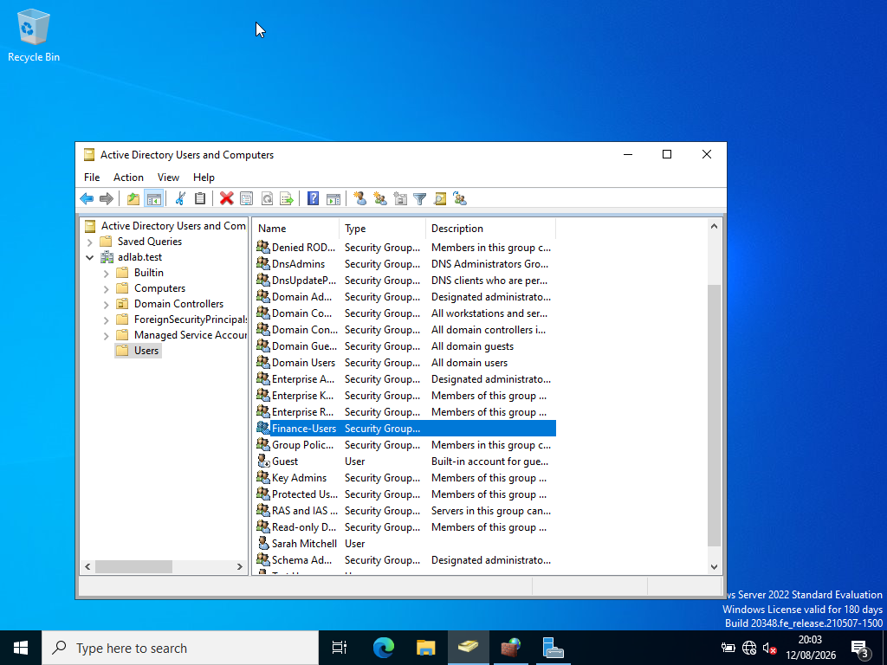
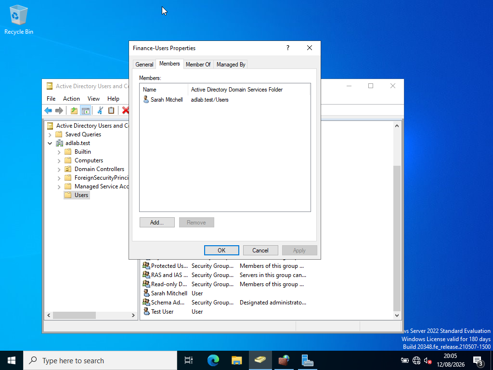
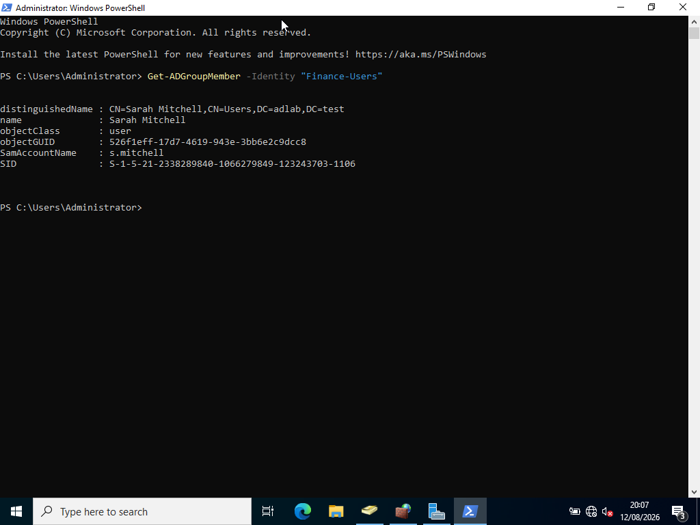
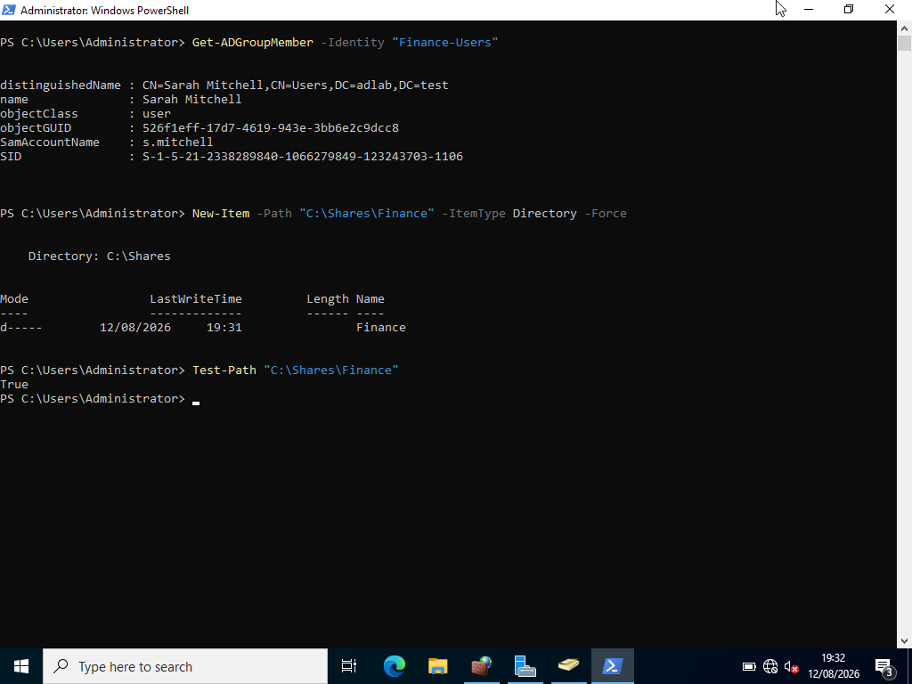
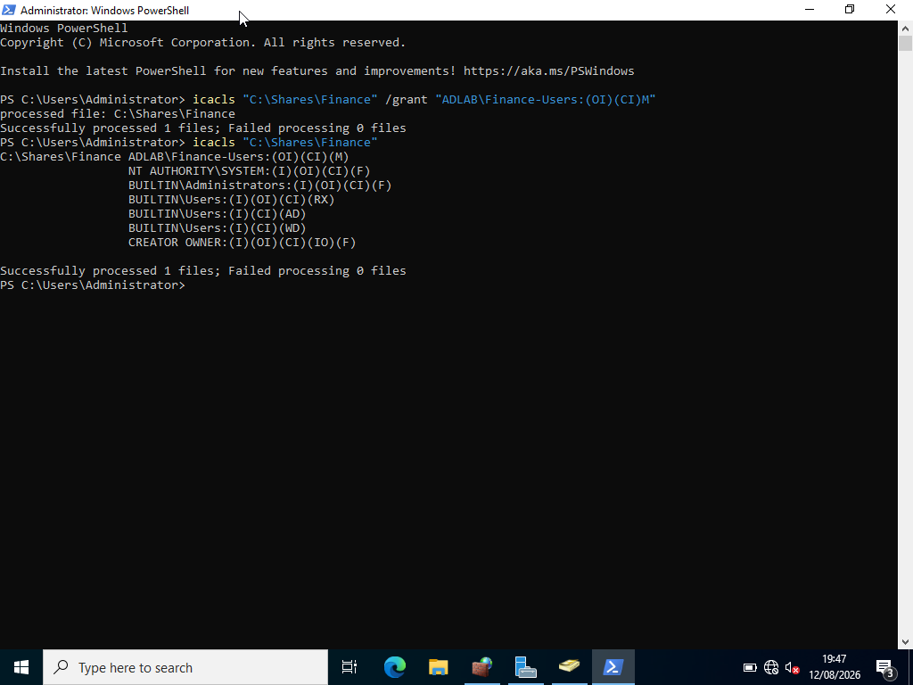
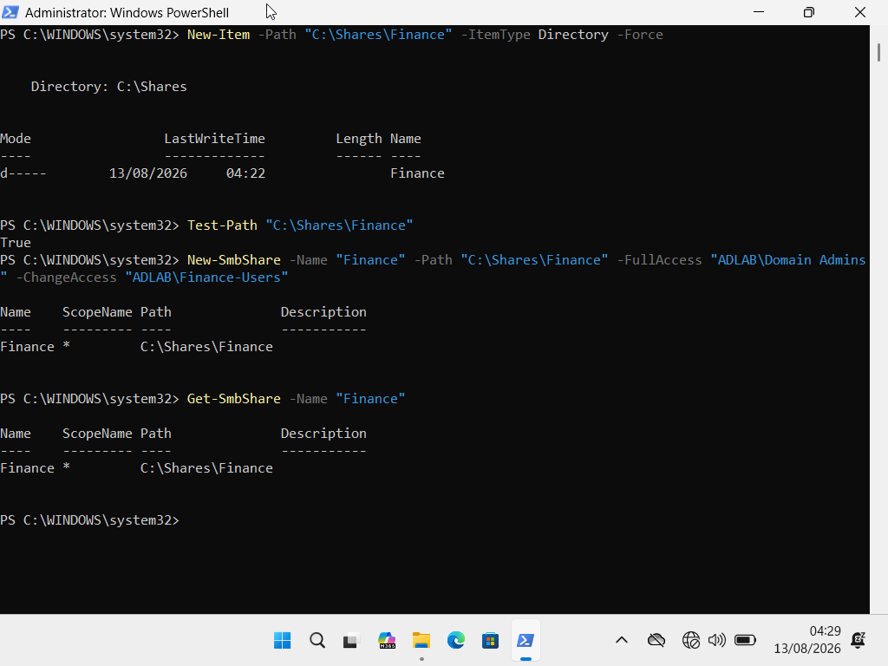
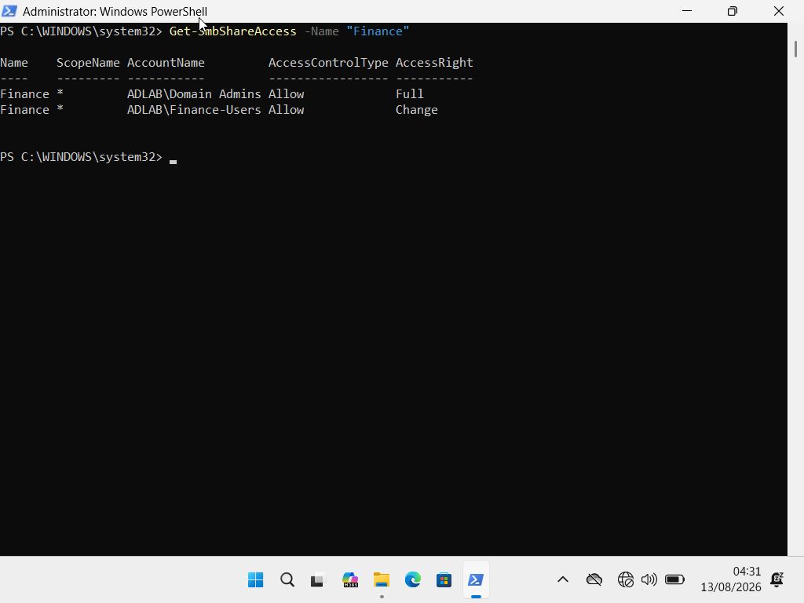
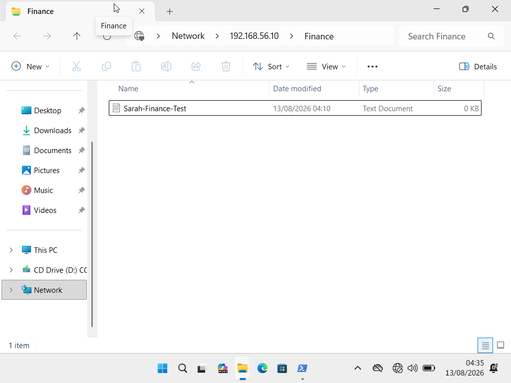

# Lab 02 — Security Groups & Permissions

## Overview

This lab demonstrates how Active Directory security groups can be used to manage access to shared resources within a Windows domain environment.

A Finance shared folder was created on the Windows Server and access was controlled using an Active Directory security group.

The lab followed a structured IT Support and administration process:

**Task / Problem → Investigation → Action → Verification → Documentation**

The objective was to demonstrate practical experience with:

- Active Directory security groups
- Group membership management
- NTFS permissions
- SMB share permissions
- Network file sharing
- User access testing
- PowerShell administration
- Permission verification
- Troubleshooting
- Access control

---

# Lab Environment

- **Windows Server**
- **Active Directory Domain Services (AD DS)**
- **Active Directory Users and Computers (ADUC)**
- **Windows PowerShell**
- **SMB File Sharing**
- **NTFS Permissions**
- **Active Directory Security Groups**
- **Windows 10/11 Client**
- **VirtualBox**
- **SUPPORT-PC01**
- **AD-DC01**

### Domain

```text
adlab.test
````

### Domain Controller

```text
AD-DC01
```

### Client Computer

```text
SUPPORT-PC01
```

### User

```text
Sarah Mitchell
```

### Security Group

```text
Finance-Users
```

### Shared Folder

```text
C:\Shares\Finance
```

### Network Share

```text
\\192.168.56.10\Finance
```

---

# Task 1 — Create the Finance Security Group

## Scenario

The organisation requires a security group to control access to a Finance shared folder.

Rather than assigning permissions directly to individual users, a dedicated Active Directory security group was created.

The group created was:

```text
Finance-Users
```

The group was configured as:

* **Group scope:** Global
* **Group type:** Security

## Investigation

Active Directory Users and Computers was used to verify that the group did not already exist.

## Action

The `Finance-Users` security group was created in the Active Directory `Users` container.

## Verification

The group was displayed in Active Directory Users and Computers after creation.

## Evidence



**Screenshot:** `01-finance-group-created.png`

---

# Task 2 — Add Sarah Mitchell to the Security Group

## Scenario

Sarah Mitchell requires access to the Finance shared folder.

Instead of assigning permissions directly to her account, Sarah was added to the `Finance-Users` security group.

This follows the principle of managing resource access through security groups.

## Investigation

Sarah Mitchell's Active Directory account was located and the membership of the `Finance-Users` group was checked.

## Action

Sarah Mitchell was added as a member of:

```text
Finance-Users
```

## Verification

Group membership was verified using both Active Directory Users and Computers and PowerShell.

The following PowerShell command was used:

```powershell
Get-ADGroupMember -Identity "Finance-Users"
```

The output confirmed that Sarah Mitchell was a member of the group.

## Evidence



**Screenshot:** `02-sarah-added-to-finance-group.png`



**Screenshot:** `03-finance-group-membership-verification.png`

---

# Task 3 — Create the Finance Folder and Configure NTFS Permissions

## Scenario

A shared Finance folder was required on the Windows Server.

The folder was created at:

```text
C:\Shares\Finance
```

## Investigation

Before configuring permissions, the existing NTFS permissions on the folder were reviewed.

The following PowerShell command was used:

```powershell
Get-Acl "C:\Shares\Finance" |
Select-Object -ExpandProperty Access
```

The command returned the existing Windows NTFS permission entries.

The existing permissions were left unchanged.

## Action

The Finance folder was created using PowerShell:

```powershell
New-Item -Path "C:\Shares\Finance" -ItemType Directory -Force
```

The folder was then assigned Modify permissions for the `Finance-Users` security group.

The following command was used:

```powershell
icacls "C:\Shares\Finance" /grant "ADLAB\Finance-Users:(OI)(CI)M"
```

Where:

* `OI` = Object Inherit
* `CI` = Container Inherit
* `M` = Modify

This allows the group permission to be inherited by files and subfolders within the Finance folder.

## Verification

The NTFS permissions were verified using:

```powershell
icacls "C:\Shares\Finance"
```

The following entry was confirmed:

```text
ADLAB\Finance-Users:(OI)(CI)(M)
```

This confirmed that members of the `Finance-Users` group had Modify permissions.

## Evidence



**Screenshot:** `04-finance-folder-created.png`



**Screenshot:** `05-finance-ntfs-permission.png`

---

# Task 4 — Create and Configure the SMB Network Share

## Scenario

The Finance folder needed to be accessible over the network from client computers.

The required network share was:

```text
\\AD-DC01\Finance
```

The server IP address was also used during testing:

```text
\\192.168.56.10\Finance
```

## Investigation

The SMB service and network connectivity were investigated during configuration.

From the client computer, SMB connectivity was tested using:

```powershell
Test-NetConnection 192.168.56.10 -Port 445
```

The result was:

```text
TcpTestSucceeded : True
```

This confirmed that SMB network connectivity between the client and server was available.

The SMB share itself was then checked on the server.

## Initial Problem

The first attempt to access the Finance share failed because the SMB share had not been successfully created.

The following command was used to check for the share:

```powershell
Get-SmbShare -Name "Finance"
```

The result indicated that the Finance SMB share did not exist.

The folder path was also checked.

## Action

The Finance folder was recreated and verified:

```powershell
New-Item -Path "C:\Shares\Finance" -ItemType Directory -Force
```

The folder was then verified:

```powershell
Test-Path "C:\Shares\Finance"
```

The result was:

```text
True
```

The SMB share was then created:

```powershell
New-SmbShare -Name "Finance" -Path "C:\Shares\Finance" -FullAccess "ADLAB\Domain Admins" -ChangeAccess "ADLAB\Finance-Users"
```

This configured:

* `Domain Admins` → Full Access
* `Finance-Users` → Change Access

## Verification

The SMB share was verified using:

```powershell
Get-SmbShare -Name "Finance"
```

The share was confirmed to point to:

```text
C:\Shares\Finance
```

Share permissions were then checked using:

```powershell
Get-SmbShareAccess -Name "Finance"
```

The `Finance-Users` group was confirmed with Change access.

## Evidence



**Screenshot:** `06-finance-share-created.png`



**Screenshot:** `07-finance-share-permissions.png`

---

# Task 5 — Test Sarah Mitchell's Access

## Scenario

The final stage was to verify that Sarah Mitchell could access the Finance shared folder using the permissions configured through the `Finance-Users` security group.

The test was performed from:

```text
SUPPORT-PC01
```

using Sarah Mitchell's domain account.

## Action

Sarah Mitchell's account was used to log into the client computer.

The user was authenticated using the domain account:

```text
ADLAB\s.mitchell
```

## Evidence


**Screenshot:** `08-sarah-login.png`

> Passwords and other authentication credentials were not included in the evidence.

## Access Test

The Finance share was accessed from the client using:

```text
\\192.168.56.10\Finance
```

The initial File Explorer test did not display the folder.

Further investigation was performed using PowerShell.

The following command was used:

```powershell
net use \\192.168.56.10\Finance
```

The command completed successfully, confirming that the client could establish an SMB connection to the Finance share.

The share was then opened directly using:

```powershell
explorer.exe "\\192.168.56.10\Finance"
```

The Finance folder opened successfully.

## Write Access Test

A test file was created inside the Finance folder:

```text
Sarah-Finance-Test.txt
```

The file contained:

```text
Finance access test successful.
```

The successful creation and modification of the file demonstrated that Sarah had write/Modify access to the Finance resource.

## Verification

The access test confirmed the complete permission path:

```text
Sarah Mitchell
       ↓
Finance-Users
       ↓
NTFS Modify Permission
       ↓
SMB Share Change Permission
       ↓
Finance Shared Folder
       ↓
Successful File Creation
```

## Evidence



**Screenshot:** `09-sarah-finance-access.png`

---

# Troubleshooting

During the lab, the Finance share initially could not be accessed from the client computer.

The troubleshooting process followed a structured approach.

### 1. Network Connectivity

SMB connectivity was tested:

```powershell
Test-NetConnection 192.168.56.10 -Port 445
```

Result:

```text
TcpTestSucceeded : True
```

This confirmed that the client could communicate with the server over SMB.

### 2. SMB Share Investigation

The existence of the share was checked:

```powershell
Get-SmbShare -Name "Finance"
```

The share was initially missing.

### 3. Folder Path Investigation

The folder path was checked and recreated:

```powershell
New-Item -Path "C:\Shares\Finance" -ItemType Directory -Force
```

The path was then verified:

```powershell
Test-Path "C:\Shares\Finance"
```

Result:

```text
True
```

### 4. SMB Share Creation

The missing SMB share was created:

```powershell
New-SmbShare -Name "Finance" -Path "C:\Shares\Finance" -FullAccess "ADLAB\Domain Admins" -ChangeAccess "ADLAB\Finance-Users"
```

### 5. Connection Verification

The client was then able to establish an SMB connection using:

```powershell
net use \\192.168.56.10\Finance
```

The command completed successfully.

### 6. Final Verification

The Finance folder was opened successfully and Sarah Mitchell was able to create a test file.

### Root Cause

The initial access problem was caused by the Finance folder not being successfully published as an SMB network share.

Once the folder was recreated and the SMB share was configured, network access was successful.

---

# Permissions Configuration

The final access configuration was:

| Resource              | Permission  | Assigned To   |
| --------------------- | ----------- | ------------- |
| Finance folder — NTFS | Modify      | Finance-Users |
| Finance share — SMB   | Change      | Finance-Users |
| Finance share — SMB   | Full Access | Domain Admins |

This demonstrates the difference between **NTFS permissions** and **Share permissions**.

The effective access to the shared resource is controlled by the combination of these permissions.

---

# Skills Demonstrated

This lab demonstrated practical experience with:

* Active Directory security groups
* Group creation
* Group membership management
* Active Directory Users and Computers
* PowerShell administration
* NTFS permissions
* `icacls`
* SMB network shares
* Share permissions
* `New-SmbShare`
* `Get-SmbShare`
* `Get-SmbShareAccess`
* Network connectivity testing
* `Test-NetConnection`
* `net use`
* Windows File Explorer
* User access testing
* Permission troubleshooting
* Root-cause analysis
* Verification and documentation

---

# Support Methodology

The lab followed a structured IT Support troubleshooting methodology:

### 1. Task / Problem

Identify the required resource and access requirement.

### 2. Investigation

Check the Active Directory group, user membership, folder permissions, share configuration, and network connectivity.

### 3. Action

Create the security group, assign group membership, configure NTFS permissions, create the SMB share, and configure share permissions.

### 4. Verification

Test connectivity and confirm that Sarah Mitchell can access and modify the Finance shared folder.

### 5. Documentation

Record the configuration, commands, troubleshooting process, results, and supporting screenshots.

---

# Outcome

The Finance shared folder was successfully configured and made available to members of the `Finance-Users` security group.

Sarah Mitchell was successfully added to the group and was able to access the Finance network share from `SUPPORT-PC01`.

The successful creation of a test file demonstrated that the configured permissions allowed the required Modify access.

The lab also demonstrated practical troubleshooting when the SMB share was initially unavailable.

The issue was investigated by checking:

```text
Network connectivity
        ↓
SMB port 445
        ↓
Folder path
        ↓
SMB share
        ↓
Share permissions
        ↓
User access
```

The problem was resolved by recreating the Finance folder and successfully publishing it as an SMB share.

---

# Lab Status

**Lab 02 — Security Groups & Permissions: COMPLETED ✅**

**Completed tasks: 5/5**

* [x] Create a security group
* [x] Add a user to the security group
* [x] Create a shared folder
* [x] Configure NTFS permissions
* [x] Configure SMB share permissions
* [x] Test user access
* [x] Troubleshoot and verify network access
