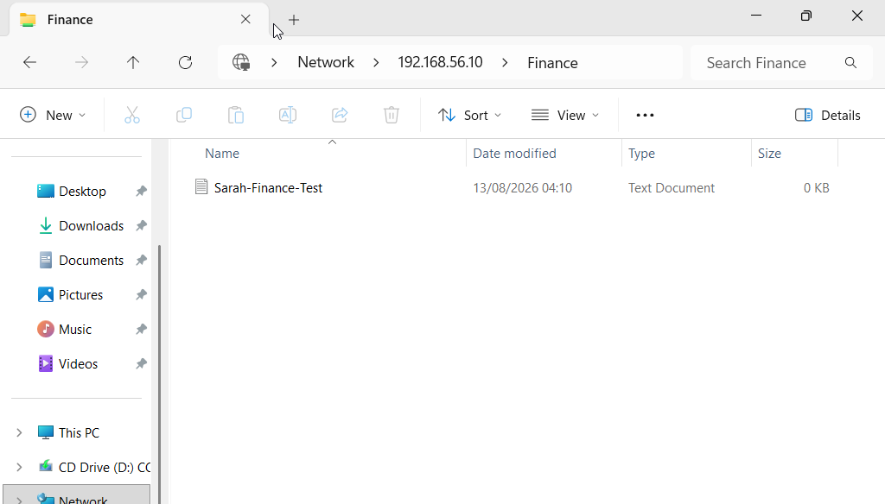
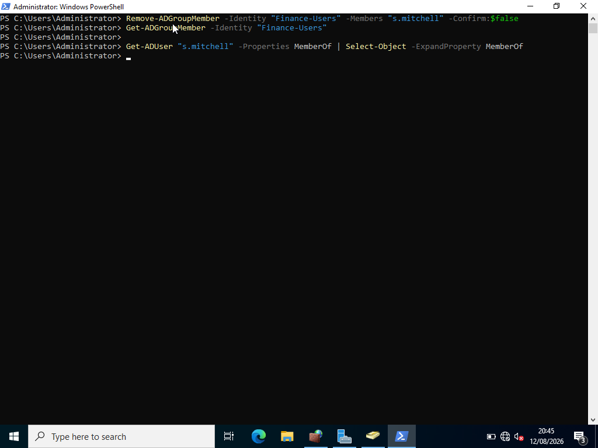
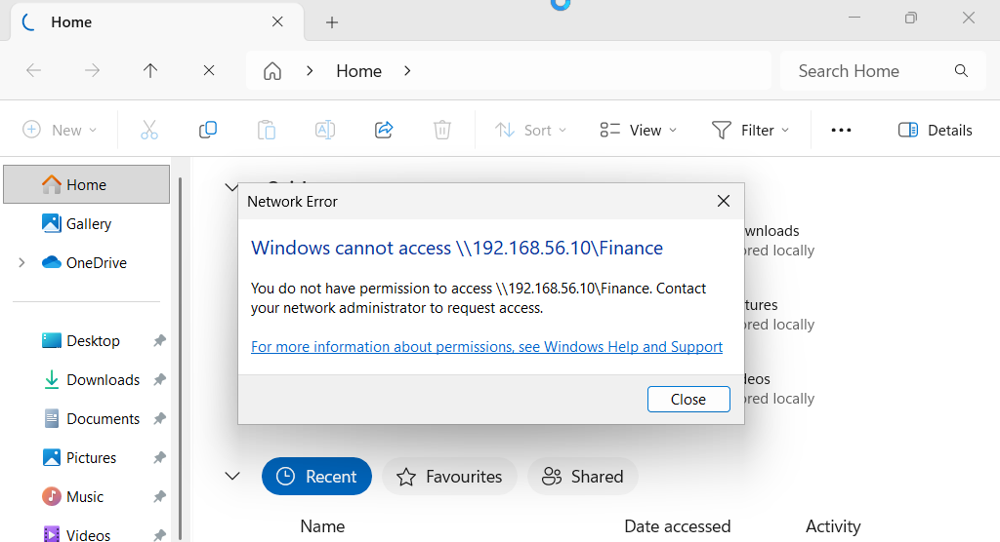
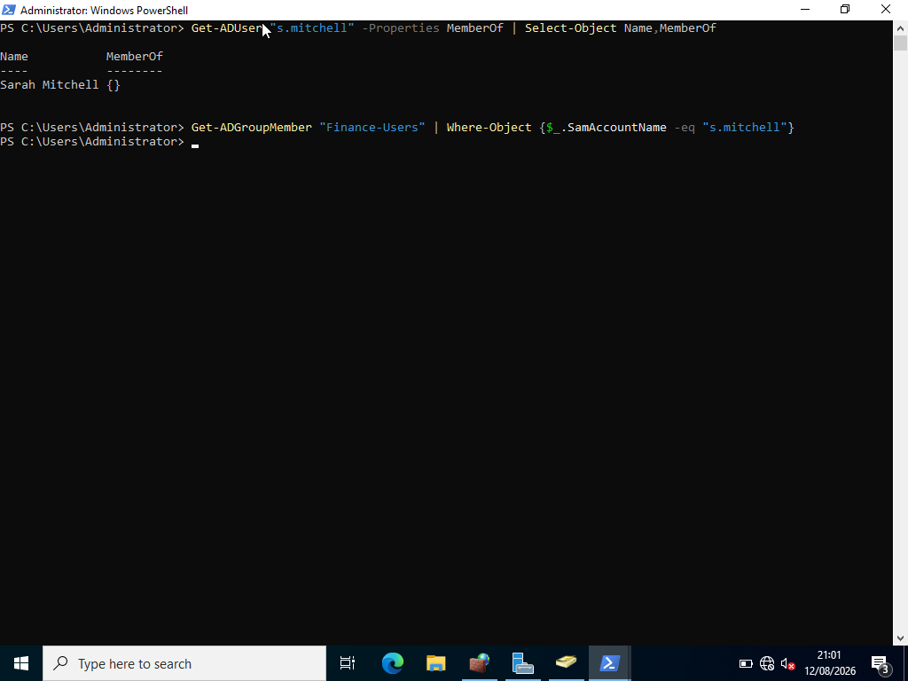
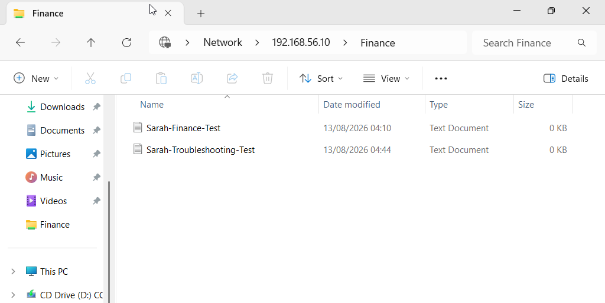

# Lab 03 — Shared Folder Access Troubleshooting

## Overview

This lab demonstrates a practical Service Desk troubleshooting scenario involving a domain user who is unable to access a shared folder.

A controlled access problem was introduced by removing a user from the Active Directory security group responsible for access to the Finance shared folder.

The issue was then investigated using Active Directory and Windows tools.

The root cause was identified, the user's group membership was restored, and access to the shared folder was successfully verified.

The lab follows a structured IT Support troubleshooting process:

**Task / Problem → Investigation → Action → Verification → Documentation**

---

# Service Desk Scenario

### Incident

**Incident ID:** INC-003

**User:** Sarah Mitchell

**Resource:** Finance Shared Folder

**Issue:**

> "I can't access the Finance shared folder."

The user reported that Windows could not access the Finance network share.

The shared folder was:

```text
\\192.168.56.10\Finance
````

---

# Lab Environment

* **Windows Server**
* **Active Directory Domain Services (AD DS)**
* **Active Directory Users and Computers (ADUC)**
* **Windows PowerShell**
* **SMB File Sharing**
* **NTFS Permissions**
* **Active Directory Security Groups**
* **Virtual Machine**
* **SUPPORT-PC01**
* **AD-DC01**

### Domain

```text
ADLAB
```

### Domain Controller

```text
AD-DC01
```

### Client Computer

```text
SUPPORT-PC01
```

### User

```text
Sarah Mitchell
```

### User Account

```text
s.mitchell
```

### Security Group

```text
Finance-Users
```

### Finance Share

```text
\\192.168.56.10\Finance
```

---

# Troubleshooting Method

The issue was investigated using the following structured approach:

```text
Identify the problem
        ↓
Confirm the problem
        ↓
Investigate user account
        ↓
Investigate group membership
        ↓
Identify root cause
        ↓
Restore required access
        ↓
Verify the solution
        ↓
Document the result
```

This approach reflects a typical first-line IT Support troubleshooting process.

---

# Task 1 — Establish a Known-Good Baseline

Before introducing the simulated fault, Sarah's access to the Finance shared folder was confirmed.

Sarah was logged into:

```text
SUPPORT-PC01
```

using her domain account.

The Finance share was opened:

```text
\\192.168.56.10\Finance
```

Sarah was able to access the Finance folder successfully.

This established a known-good baseline before the troubleshooting scenario was introduced.

## Evidence



**Screenshot:** `01-baseline-finance-access.png`

---

# Task 2 — Simulate the Access Problem

To create a controlled Helpdesk scenario, Sarah was deliberately removed from the `Finance-Users` security group.

The group provides access to the Finance shared folder.

The following PowerShell command was used on the domain controller:

```powershell
Remove-ADGroupMember -Identity "Finance-Users" -Members "s.mitchell" -Confirm:$false
```

The purpose of this step was to simulate a realistic permissions problem that could occur in an organisation.

## Verification

Sarah's group membership was checked to confirm that she was no longer a member of `Finance-Users`.

```powershell
Get-ADGroupMember -Identity "Finance-Users"
```

Sarah was no longer listed as a member.

## Evidence



**Screenshot:** `02-sarah-removed-from-finance-group.png`

---

# Task 3 — Reproduce the User's Problem

The next step was to reproduce the reported issue from the user's workstation.

Sarah was logged into:

```text
SUPPORT-PC01
```

The Finance network share was accessed using:

```text
\\192.168.56.10\Finance
```

Windows returned an access error indicating that the Finance shared folder could not be accessed.

The error confirmed that the reported problem could be reproduced.

## User-Facing Error

The Windows error displayed:

```text
Windows cannot access "\\192.168.56.10\Finance"
```

This provided the first-line support technician with a clear symptom to investigate.

## Evidence



**Screenshot:** `03-finance-access-denied.png`

---

# Task 4 — Investigate the User's Group Membership

The next step was to determine whether Sarah still had the required Active Directory group membership.

The user's group membership was investigated on the domain controller.

The following PowerShell command was used:

```powershell
Get-ADUser "s.mitchell" -Properties MemberOf |
Select-Object Name,MemberOf
```

The `Finance-Users` group was not present in Sarah's membership.

A direct group membership check was also performed:

```powershell
Get-ADGroupMember "Finance-Users" |
Where-Object {$_.SamAccountName -eq "s.mitchell"}
```

No result was returned.

This confirmed that Sarah was no longer a member of the `Finance-Users` security group.

## Root Cause

The investigation identified the root cause:

> **Sarah Mitchell was not a member of the `Finance-Users` security group.**

Because the Finance shared folder relied on this security group for access, Sarah no longer had the required permissions.

## Evidence



**Screenshot:** `04-sarah-group-membership-investigation.png`

---

# Task 5 — Corrective Action

Once the root cause was identified, Sarah's membership of the `Finance-Users` security group was restored.

The following PowerShell command was used:

```powershell
Add-ADGroupMember -Identity "Finance-Users" -Members "s.mitchell"
```

The group membership was then verified:

```powershell
Get-ADGroupMember -Identity "Finance-Users"
```

Sarah Mitchell was displayed as a member of the group.

This restored the Active Directory group membership required for access to the Finance shared folder.

---

# Task 6 — Verify the Solution

After restoring the group membership, Sarah signed out of the client computer and signed back in.

This ensured that a new Windows logon session was established and the updated group membership could be applied.

The Finance shared folder was then accessed again:

```text
\\192.168.56.10\Finance
```

The Finance folder opened successfully.

A test file was created:

```text
Sarah-Troubleshooting-Test.txt
```

The successful access and file creation confirmed that Sarah had regained the required permissions.

## Evidence



**Screenshot:** `05-sarah-access-restored.png`

---

# Root Cause Analysis

The issue was caused by a missing Active Directory security group membership.

### Before the issue

```text
Sarah Mitchell
      ↓
Finance-Users
      ↓
NTFS Modify Permission
      ↓
SMB Share Change Permission
      ↓
Finance Folder
      ↓
Access Granted
```

### During the incident

```text
Sarah Mitchell
      ↓
Finance-Users membership missing
      ↓
Required access not available
      ↓
Finance Folder
      ↓
Access Denied
```

### After the fix

```text
Sarah Mitchell
      ↓
Finance-Users
      ↓
NTFS Modify Permission
      ↓
SMB Share Change Permission
      ↓
Finance Folder
      ↓
Access Restored
```

---

# Troubleshooting Process

The incident demonstrated a structured approach to diagnosing an access problem.

### 1. Identify

The user reported that the Finance shared folder could not be accessed.

### 2. Reproduce

The problem was reproduced from the user's workstation.

### 3. Investigate

The user's Active Directory group membership was checked.

### 4. Identify Root Cause

Sarah was found to be missing from the `Finance-Users` security group.

### 5. Resolve

Sarah was added back to the required security group.

### 6. Verify

Sarah logged in again and successfully accessed the Finance shared folder.

### 7. Document

The incident, investigation, corrective action, and verification were documented with supporting screenshots.

---

# Evidence

The supporting screenshots for this lab are stored in the repository's `screenshots/` directory.

```text
screenshots/
├── 01-baseline-finance-access.png
├── 02-sarah-removed-from-finance-group.png
├── 03-finance-access-denied.png
├── 04-sarah-group-membership-investigation.png
└── 05-sarah-access-restored.png
```

---

# Skills Demonstrated

This lab demonstrated practical experience with:

* Active Directory troubleshooting
* Security group investigation
* Group membership management
* User access troubleshooting
* SMB shared folders
* NTFS permissions
* Share permissions
* PowerShell
* Active Directory Users and Computers
* Root-cause analysis
* Access troubleshooting
* Incident investigation
* User access verification
* Service Desk methodology
* Technical documentation

---

# Tools Used

* Windows Server
* Active Directory Domain Services
* Active Directory Users and Computers
* Windows PowerShell
* SMB File Sharing
* Windows File Explorer
* SUPPORT-PC01
* AD-DC01

---

# Outcome

The simulated Service Desk incident was successfully investigated and resolved.

The investigation established that the user's inability to access the Finance shared folder was caused by missing membership of the `Finance-Users` security group.

The user's group membership was restored and the result was verified by signing in again and successfully accessing the Finance shared folder.

The successful creation of a test file provided additional evidence that the required access had been restored.

The incident demonstrated the complete support process:

**Identify → Investigate → Resolve → Verify → Document**

---

# Lab Status

**Lab 03 — Shared Folder Access Troubleshooting: COMPLETED ✅**

The Active Directory Helpdesk Lab is now complete.

* [x] Lab 01 — User Account Management
* [x] Lab 02 — Security Groups & Permissions
* [x] Lab 03 — Shared Folder Access Troubleshooting
